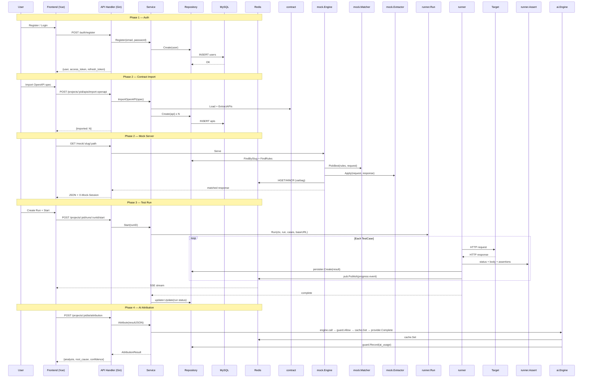

# Sentinel — Design Document

## C4 Context

```
User (Browser) → [Sentinel SPA :5180] → [Sentinel API :8081] → [MySQL :3307]
                                                       → [Redis :6380]
                                                       → [Target API]
                                                       → [AI Provider]
```

## MVP Data Flow



## Error Code Table

| HTTP | Code | Constant | Sentinel |
|---|---|---|---|
| 400 | 40000 | `BAD_REQUEST` | `ErrBadRequest` |
| 401 | 40100 | `AUTH_INVALID_TOKEN` | `ErrInvalidToken` |
| 401 | 40101 | `AUTH_TOKEN_EXPIRED` | `ErrTokenExpired` |
| 401 | 40102 | `AUTH_INVALID_CREDENTIALS` | `ErrInvalidCredentials` |
| 403 | 40300 | `FORBIDDEN` | `ErrForbidden` |
| 404 | 40400 | `NOT_FOUND` | `ErrNotFound` |
| 409 | 40900 | `CONFLICT` | `ErrConflict` |
| 422 | 42200 | `MOCK_NO_MATCH` | (mock internal) |
| 429 | 42900 | `AI_*_BUDGET_EXCEEDED` | `ErrDailyBudgetExceeded` |
| 503 | 50300 | `AI_DISABLED` | `ErrAIDisabled` |
| 500 | 50000 | (internal) | (fallback) |
